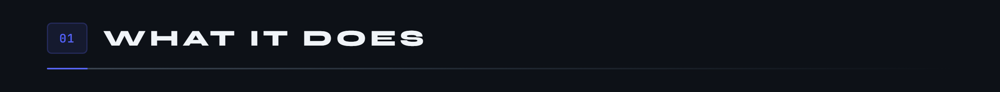
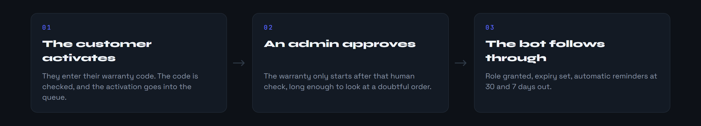
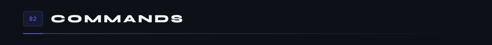
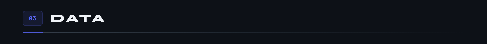
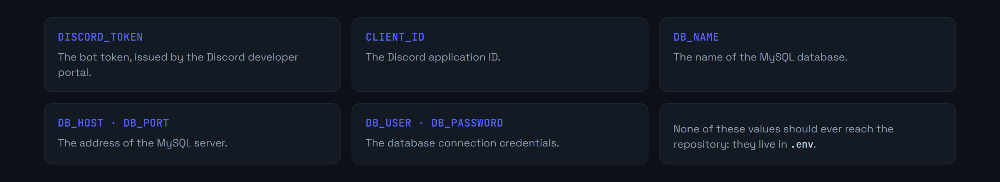
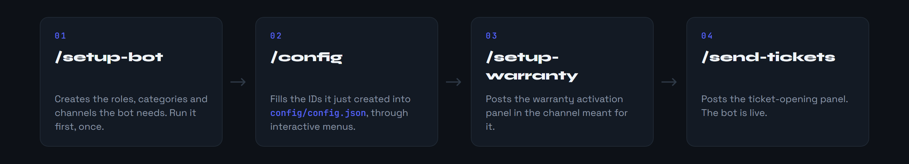
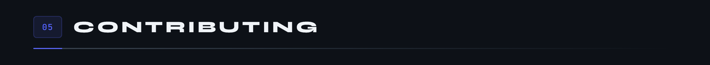

<div align="center">

<p>
  <a href="README.md"></a>
  
</p>


</div>

MicroCoaster sells 3D-printed miniature roller coasters. Every product ships with a warranty code, and all after-sales support happens on Discord. This bot is the link: it checks the codes, opens the tickets, routes them to the right team and keeps a record of everything.



**Warranties, in two steps.** The customer activates their code themselves, but the warranty only starts after a human approval. That pause leaves time to look at a doubtful order before committing to twelve months of cover.



The warranty role survives leaving the server: on every arrival, the bot checks `user_roles_backup` and restores what was owed. An integrity check also runs at startup, to catch up on roles lost during an outage.

**Ticketing, in four categories.** Technical, product, sales, recruitment, each notifying its own team. Every ticket gets an incrementing number, a dedicated channel, an adjustable priority, and a transcript archived on close.







```bash
git clone https://github.com/Microcoaster/Microcoaster-bot.git
cd Microcoaster-bot
npm install
cp .env.example .env
```

**Database.** MySQL 8.0 or above. Create the database and the user, then let the bot create its tables on first boot.

```sql
CREATE DATABASE microcoaster_bot CHARACTER SET utf8mb4 COLLATE utf8mb4_unicode_ci;
CREATE USER 'bot_user'@'localhost' IDENTIFIED BY 'un_mot_de_passe_solide';
GRANT ALL PRIVILEGES ON microcoaster_bot.* TO 'bot_user'@'localhost';
FLUSH PRIVILEGES;
```

**Environment variables.**



**Getting it running.**

```bash
npm start          # the bot starts and registers its commands
```

Then on the Discord server, in this order.





Three things to know before touching the repository.

- `config/config.json` holds Discord server IDs, specific to one installation. Reconfigure with `/config` rather than reusing them as they are.
- The commands are registered globally at startup. Discord can take up to an hour to propagate them.
- The scheduled jobs, reminders and the daily cleanup, follow the host machine's timezone.

The modular architecture builds on a Discord.js template under the MIT licence. The business logic, warranties, ticketing and role restoration, is specific to MicroCoaster.

The contribution cycle is the organisation's: an issue describes the work, a branch starts from `develop`, a pull request comes back onto it and goes through review.

---

<sub>MicroCoaster · Authors: Cybertrist, Yamakajump</sub>
