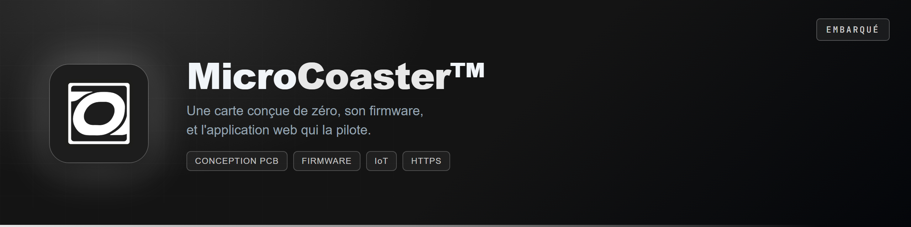

<div align="center">




**Activation des garanties, billetterie client et modération pour le serveur Discord MicroCoaster™.**

[](https://nodejs.org/)
[](https://discord.js.org/)
[](https://www.mysql.com/)
[](LICENSE)

</div>

---

MicroCoaster™ vend des montagnes russes miniatures imprimées en 3D. Chaque produit est livré avec un code de garantie, et tout le service après-vente se passe sur Discord. Ce bot fait le lien : il vérifie les codes, ouvre les tickets, route vers la bonne équipe et garde la trace de tout.

## Comment fonctionne la garantie

L'activation se fait en deux temps, volontairement. Le client active son code lui-même, mais la garantie ne démarre qu'après validation humaine, ce qui laisse le temps de vérifier une commande douteuse avant d'engager douze mois de couverture.

```
Client : /activate  →  code validé, activation en attente
Admin  : /activate-warranty  →  garantie ouverte, rôle attribué, échéance posée
Bot    : rappels automatiques à J-30 et J-7
```

Le rôle de garantie survit aux départs du serveur : à chaque arrivée, le bot consulte `user_roles_backup` et restaure ce qui était dû. Un contrôle d'intégrité passe aussi au démarrage, pour rattraper les rôles perdus pendant une coupure.

## Billetterie

Quatre catégories, chacune notifiant son équipe : **technique**, **produit**, **commercial**, **recrutement**. Chaque ticket reçoit un numéro incrémental, un salon dédié, une priorité modifiable, et une transcription archivée à la fermeture.

## Commandes

**Garanties**

| Commande | Accès | Rôle |
|:--|:--|:--|
| `/add-code` | Admin | Ajoute un code premium au système |
| `/activate-warranty` | Admin | Valide une activation en attente |
| `/list-pending-warranties` | Admin | Liste les activations à traiter |
| `/warranty-extend` | Admin | Prolonge une garantie existante |
| `/setup-warranty` | Admin | Publie le panneau d'activation |

**Support**

| Commande | Accès | Rôle |
|:--|:--|:--|
| `/send-tickets` | Admin | Publie le panneau d'ouverture de ticket |

**Modération**

| Commande | Accès | Rôle |
|:--|:--|:--|
| `/ban` · `/unban` | Modérateur | Bannissement et levée |
| `/mute` | Modérateur | Réduction au silence temporaire |
| `/warn` | Modérateur | Avertissement manuel tracé |

**Administration**

| Commande | Accès | Rôle |
|:--|:--|:--|
| `/setup-bot` | Admin | Crée rôles, salons et catégories en une fois |
| `/config` · `/config-view` | Admin | Configuration par menus interactifs |
| `/assign-member-role` | Admin | Attribue le rôle membre à tout le serveur |
| `/force-restore-roles` | Admin | Force la restauration des rôles de garantie |

## Installation

```bash
git clone https://github.com/Microcoaster/Microcoaster-bot.git
cd Microcoaster
npm install
cp .env.example .env
```

### Base de données

MySQL 8.0 ou supérieur. Créez la base et l'utilisateur, puis laissez le bot créer ses tables au premier démarrage.

```sql
CREATE DATABASE microcoaster_bot CHARACTER SET utf8mb4 COLLATE utf8mb4_unicode_ci;
CREATE USER 'bot_user'@'localhost' IDENTIFIED BY 'un_mot_de_passe_solide';
GRANT ALL PRIVILEGES ON microcoaster_bot.* TO 'bot_user'@'localhost';
FLUSH PRIVILEGES;
```

### Variables d'environnement

| Variable | Rôle |
|:--|:--|
| `DISCORD_TOKEN` | Token du bot |
| `CLIENT_ID` | ID de l'application Discord |
| `DB_HOST` · `DB_PORT` | Serveur MySQL |
| `DB_USER` · `DB_PASSWORD` | Identifiants MySQL |
| `DB_NAME` | Nom de la base |

### Mise en route

```bash
npm start          # le bot démarre et enregistre ses commandes
```

Puis sur le serveur Discord :

```
/setup-bot         # crée rôles, catégories et salons
/config            # renseigne les IDs dans config/config.json
/setup-warranty    # publie le panneau d'activation
/send-tickets      # publie le panneau de support
```

## Structure

```
commands/    Commandes slash, une par fichier
buttons/     Gestionnaires d'interaction des boutons
modals/      Formulaires modaux
events/      Cycle de vie Discord : ready, arrivées, départs, messages
dao/         Accès base : garanties, tickets, modération
config/      IDs de rôles, salons et catégories du serveur
```

### Tables

| Table | Contenu |
|:--|:--|
| `warranty_premium_codes` | Codes, état d'activation, échéance |
| `warranty_activation_logs` | Journal des activations |
| `support_tickets` · `ticket_counter` | Tickets et numérotation |
| `ticket_transcriptions` | Archives de conversation |
| `user_status` · `user_bans` | État et sanctions par membre |
| `user_roles_backup` · `role_restoration_logs` | Rôles sauvegardés et restaurations |
| `moderation_logs` | Piste d'audit des actions de modération |

## À savoir

- `config/config.json` contient des identifiants de serveur Discord (rôles, salons, catégories). Ce ne sont pas des secrets, mais ils sont propres à une installation : reconfigurez avec `/config` plutôt que de les reprendre tels quels.
- Les commandes sont enregistrées globalement au démarrage. Discord peut mettre jusqu'à une heure à les propager.
- Les tâches planifiées (rappels, nettoyage quotidien) suivent le fuseau horaire de la machine hôte.

## Crédits

L'architecture modulaire du bot s'appuie sur le template Discord.js de **[CyberSpaceRS](https://github.com/CyberSpaceRS)** et **[Yamakajump](https://github.com/Yamakajump)**, sous licence MIT. La logique métier (garanties, billetterie, restauration de rôles) est spécifique à MicroCoaster™.

---

<sub>Voir aussi <a href="https://github.com/Cybertrist/MicroCoaster_Docs">MicroCoaster_Docs</a> et <a href="https://github.com/Cybertrist/MicroCoaster_Forum">MicroCoaster_Forum</a>. · Tristan Joncour</sub>
