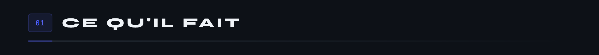
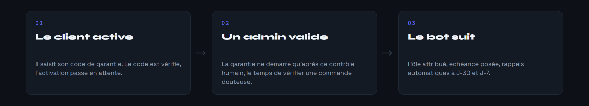
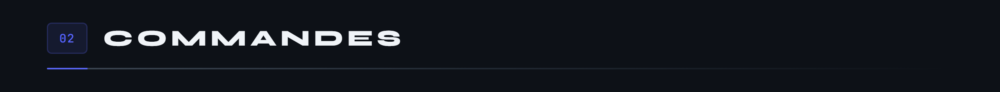
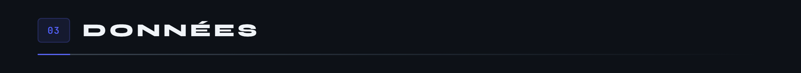
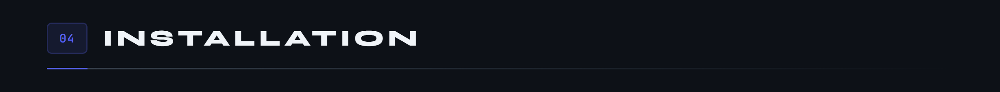
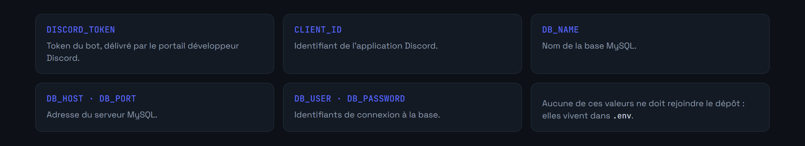
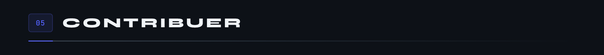

<div align="center">


</div>

MicroCoaster vend des montagnes russes miniatures imprimées en 3D. Chaque produit est livré avec un code de garantie, et tout le service après-vente se passe sur Discord. Ce bot fait le lien : il vérifie les codes, ouvre les tickets, route vers la bonne équipe et garde la trace de tout.



**Les garanties, en deux temps.** Le client active son code lui-même, mais la garantie ne démarre qu'après validation humaine. Ce délai laisse le temps de vérifier une commande douteuse avant d'engager douze mois de couverture.



Le rôle de garantie survit aux départs du serveur : à chaque arrivée, le bot consulte `user_roles_backup` et restaure ce qui était dû. Un contrôle d'intégrité passe aussi au démarrage, pour rattraper les rôles perdus pendant une coupure.

**La billetterie, en quatre catégories.** Technique, produit, commercial, recrutement, chacune notifiant son équipe. Chaque ticket reçoit un numéro incrémental, un salon dédié, une priorité modifiable, et une transcription archivée à la fermeture.






```
commands/    Commandes slash, une par fichier
buttons/     Gestionnaires d'interaction des boutons
modals/      Formulaires modaux
events/      Cycle de vie Discord : ready, arrivées, départs, messages
dao/         Accès base : garanties, tickets, modération
config/      IDs de rôles, salons et catégories du serveur
```




```bash
git clone https://github.com/Microcoaster/Microcoaster-bot.git
cd Microcoaster-bot
npm install
cp .env.example .env
```

**Base de données.** MySQL 8.0 ou supérieur. Créez la base et l'utilisateur, puis laissez le bot créer ses tables au premier démarrage.

```sql
CREATE DATABASE microcoaster_bot CHARACTER SET utf8mb4 COLLATE utf8mb4_unicode_ci;
CREATE USER 'bot_user'@'localhost' IDENTIFIED BY 'un_mot_de_passe_solide';
GRANT ALL PRIVILEGES ON microcoaster_bot.* TO 'bot_user'@'localhost';
FLUSH PRIVILEGES;
```

**Variables d'environnement.**



**Mise en route.**

```bash
npm start          # le bot démarre et enregistre ses commandes
```

Puis sur le serveur Discord :

```
/setup-bot         # crée rôles, catégories et salons
/config            # renseigne les IDs dans config/config.json
/setup-warranty    # publie le panneau d'activation
/send-tickets      # publie le panneau de support
```



Trois choses à savoir avant de toucher au dépôt.

- `config/config.json` contient des identifiants de serveur Discord, propres à une installation. Reconfigurez avec `/config` plutôt que de les reprendre tels quels.
- Les commandes sont enregistrées globalement au démarrage. Discord peut mettre jusqu'à une heure à les propager.
- Les tâches planifiées, rappels et nettoyage quotidien, suivent le fuseau horaire de la machine hôte.

L'architecture modulaire s'appuie sur un template Discord.js sous licence MIT. La logique métier, garanties, billetterie et restauration de rôles, est spécifique à MicroCoaster.

Le cycle de contribution est celui de l'organisation : une issue décrit le travail, une branche part de `develop`, une pull request revient dessus et passe en review.

---

<sub>MicroCoaster · Auteurs : Cybertrist, Yamakajump</sub>
